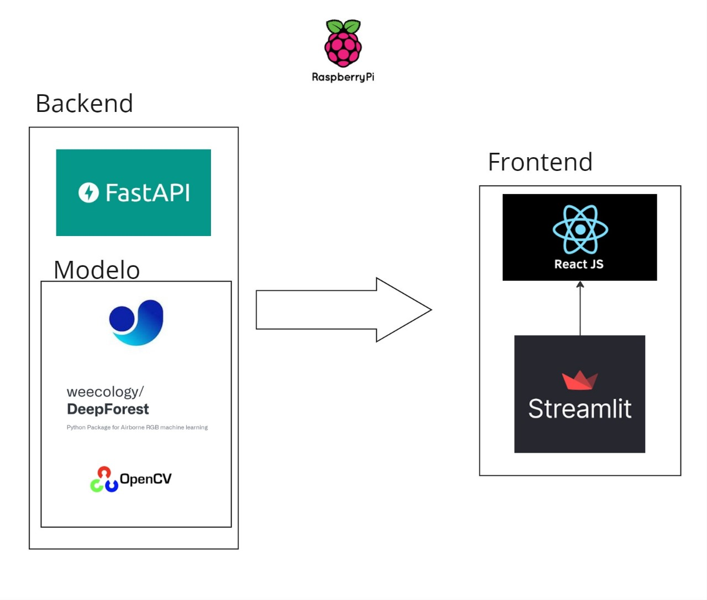

# Introdução

A arquitetura da solução refere-se ao esqueleto ou estrutura geral que descreve como os componentes de um sistema interagem entre si para alcançar um objetivo específico. Ela define os principais blocos de construção do sistema, como são interligados e como os dados fluem entre eles. Em projetos de visão computacional embarcados, a arquitetura da solução desempenha um papel crucial para garantir que todas as partes do sistema funcionem de forma coesa e eficiente, desde a coleta de dados até a interface do usuário final.

Para o projeto, a arquitetura da solução inclui um servidor embarcado (um Raspberry Pi) que hospeda um modelo de contagem utilizando técnicas de visão computacional, uma API para facilitar a comunicação entre componentes e uma interface de usuário para visualização dos resultados. Cada uma dessas tecnologias foi cuidadosamente escolhida para desempenhar um papel específico na solução.

## Tecnologias Utilizadas

Para a primeira versão da arquitetura, planejamos embarcar tudo em um **Raspberry Pi 5 de 8GB RAM**, servindo como servidor para o modelo de visão computacional, backend e frontend. A escolha foi feita pela facilidade de concentrar todos os recursos em um único lugar. O grupo optou por usar a primeira sprint como um teste.

A primeira tarefa do grupo será a criação de um modelo simples, sem foco inicial na otimização. Ao longo das semanas, o foco será na otimização do modelo, considerando tanto a acurácia quanto a escalabilidade para alcançar um bom resultado com baixo poder de processamento.

### Modelo

O modelo será desenvolvido utilizando três frameworks diferentes, como forma de testar diferentes resultados.

1. O primeiro modelo testado será o **DeepForest**, uma biblioteca em Python focada na contagem de árvores, que pode ser configurada para diferenciar se a árvore está viva ou morta.

2. O segundo modelo será criado por meio de treinamento utilizando o **[Ultralytics YOLO Nano](https://www.ultralytics.com/pt)**, uma versão reduzida projetada para dispositivos com baixa capacidade de processamento.

3. Seguindo a mesma linha, o terceiro modelo utilizará o **[PyTorch Mobile](https://pytorch.org/mobile/home/)**. Esse framework segue o mesmo padrão do **[Ultralytics YOLO Nano](https://www.ultralytics.com/pt)**.

 O objetivo de utilizar outro modelo é avaliar o desempenho que será alcançado.

 ### Backend

 O Backend será desenvolvido utilizando **[Fastapi](https://fastapi.tiangolo.com/)**, uma Web Framework para desenvolvimento de api's em pyhton. O intuito de utilizar é pelo conhecimento comum do grupo na criação de api's utilizando python e sua pracidade. 

 O Modelo irá gerar o resultado e por meio de uma api, as imagens geradas e filtradas e os resultados que serão utilizados na criação de dashboard para o frontend.

 ### Frontend

 Para o frontend, utilizaremos **[React](https://react.dev/)**, uma framework de JavaScript para criação de aplicaçoes Web.

 A escolha deve-se tambem pela praticidade e o conhecimento do grupo pela ferramenta, tornando o seu desenvolvimento mais rapido. 

 Para a geração de graficos, utilizares o **[Streamlit](https://streamlit.io/)**, uma ferramenta python voltada para a acriação de aplicações frontend. Para o contexto do grupo, será utilizado para a criação e aplicação de graficos e dados.

 # Conclução

A primeira versão da arquitetura proposta para o projeto de contagem de árvores utilizando visão computacional embarcada apresenta uma solução integrada e eficiente, utilizando tecnologias de ponta adaptadas ao contexto de um servidor embarcado. Ao concentrar todos os recursos em um Raspberry Pi, o grupo buscou simplicidade e eficiência, permitindo uma fácil implementação e testes iniciais.

A escolha das tecnologias foi orientada pela familiaridade do grupo com as ferramentas e pela capacidade de cada uma em atender às necessidades específicas do projeto. A combinação de **DeepForest**, **Ultralytics YOLO Nano** e **PyTorch Mobile** no desenvolvimento dos modelos garante uma abordagem experimental robusta, onde diferentes metodologias serão comparadas para identificar a melhor solução em termos de precisão e desempenho.

No backend, o uso do **FastAPI** visa uma integração rápida e eficiente com o modelo de visão computacional, garantindo a comunicação fluida dos resultados para o frontend. Já no frontend, a escolha de **React** e **Streamlit** proporciona uma interface de usuário interativa e dinâmica, capaz de exibir dados e gráficos de forma clara e acessível.

Essa arquitetura estabelece uma base sólida para as próximas etapas do projeto, com foco na otimização e escalabilidade do sistema, garantindo que ele possa ser ampliado e adaptado conforme necessário. À medida que o desenvolvimento avança, o grupo estará bem posicionado para refinar a solução, com o objetivo de alcançar alta precisão e eficiência no processamento de dados, mesmo em um ambiente de recursos limitados.