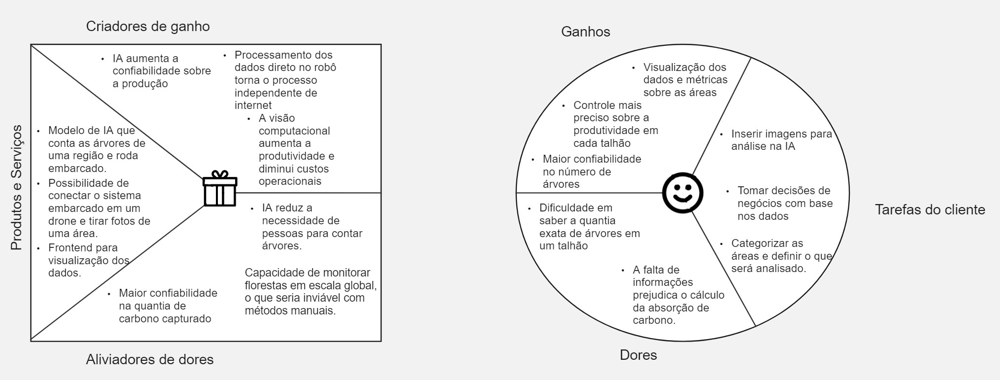

# Introdução

O canvas de proposta de valor é uma ferramenta visual que ajuda a definir e comunicar de maneira clara como a solução que o grupo vem desenvolvendo atende às necessidades específicas do parceiro de projeto. O canva descreve e destaca os aspectos que tornam o produto que será desenvolvido em uma solução única, destacando os problemas que ela resolve, as vantagens que oferece, os benefícios-chave para os clientes e o valor exclusivo que a diferencia da concorrência. Assim, o canvas de proposta de valor é uma ferramenta prática e estratégica para construir uma melhor entendimento de como o produto atende as dores do público-alvo e impulsiona o sucesso do negócio.

# O Canvas

Assim, com o objetivo de desenvolver uma solução para a Abundance que conta o número de árvores em um terreno para melhorar o cálculo dos créditos de carbono gerados em uma área de floresta plantada foi pensado o seguinte canvas proposta de valor.

Na figura acima, do lado esquerdo temos o produto e suas características e do lado direito há o consumidor. Assim, com a dor de saber quantas árvores existem em um talhão a solução que esta sendo desenvolvida tem o foco de contar árvores em uma região específica. 

https://miro.com/app/board/uXjVK7_LGM8=/?share_link_id=595348507280

https://miro.com/welcomeonboard/eXhwbEVSSFVMdE1OMGdvY3BSRXlBOEdGRzNDWVVEbXZuMlZGbXBta3hwTEEzUENNRnppNkJGS1QwcjhuT1ZZYXwzNDU4NzY0NTE4OTk5NDI0NDgzfDI=?share_link_id=510029051515
