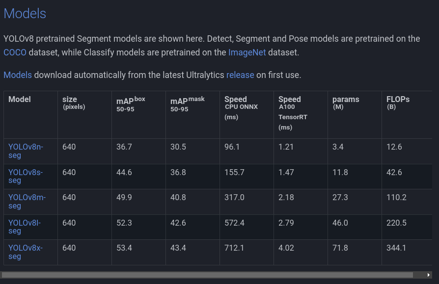

# Metricas de Avalição do Modelo

## Sobre o Modelo

Ao termino da terceira sprint, foi decidido e avaliado que o melhor modelo para ser usado é o [Instance Segmentation
](https://docs.ultralytics.com/tasks/segment/), por se tratar de um modelo de segmentação, ele é capaz de quantificar com mais precição o numero de arvores em locais onde a mata é densa. 

O YOLO, existem varias versões para diversoes fins, ao estudar, foi decidido usar o a **versão 8**  do Yolo trazendo uma arquitetura nova e simples de se usar. Dentro do Yolo V8 enxiste varias arquiteturas para diferetentes casos de uso e uma delas é o **Instance Segmentation** e ainda mais afundo, existe 5 arquiteturas voltadas ao desempenho eficaz ou um desemprenho mais preciso, dependendo do uso necessario. 

, se constitue como um modelo otimizado do modelo 
O YOLOv8 Nano é uma versão otimizada do modelo YOLOv8, projetada para ser leve e eficiente, ideal para rodar em dispositivos com recursos limitados, como Raspberry Pi ou dispositivos móveis. 

